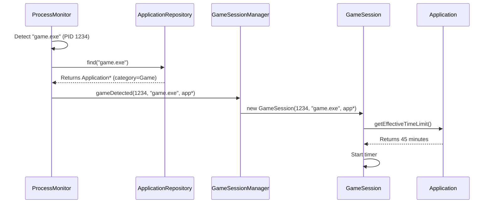
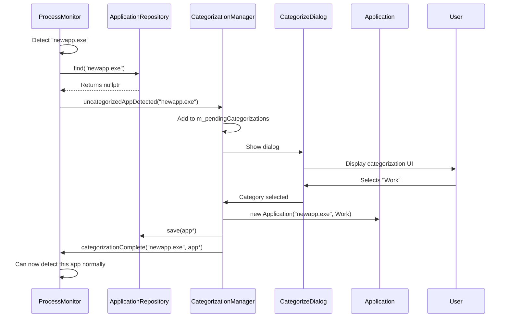
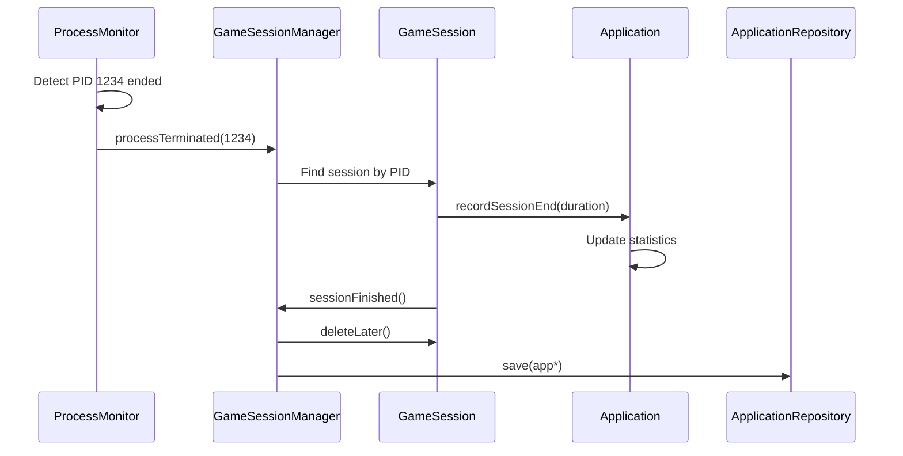
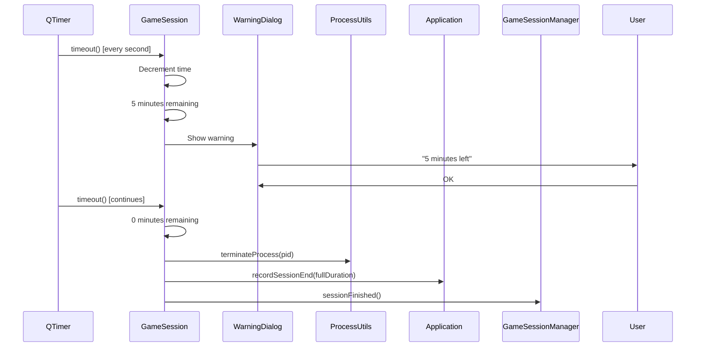

# Signal/Slot Data Flow Documentation

## 1. Signal/Slot Inventory

### ProcessMonitor Signals
|        Signal       |       Parameters      |       Emitted When        |                 Connected To                   |
|---------------------|-----------------------|---------------------------|------------------------------------------------|
|  `processStarted`   |   `DWORD, QString`    |      New App Detected     |   `ProcessEventDispatcher::onProcessStarted`   |
| `processTerminated` |      `DWORD pid`      |   Tracked Process Ended   |  `ProcessEventDispatcher::onProcessTerminated` |

### ProcessEventDispatcher Signals
|            Signal          |        Parameters       |       Emitted When        |                   Connected To                    |
|----------------------------|-------------------------|---------------------------|---------------------------------------------------|
|       `gameDetected`       |    `Application* app`   |    New Process is Game    |        `GameSessionManager::onGameDetected`       |
| `uncategorizedAppDetected` |`DWORD pid, QString name`|    Uncat. App Detected    |`CategorizationManager::onUncategorizedAppDetected`|

### Process Event Dispatcher Slots
|           Slots            |         Arguments        |
|----------------------------|--------------------------|
|      `processStarted`      |     `DWORD, QString`     |


### CategorizationManager Signals
| Signal | Parameters | Emitted When | Connected To |
|--------|-----------|--------------|--------------|
| `categorizationComplete` | `QString name, Application* app` | User categorizes an app | `ProcessMonitor::onCategorizationComplete` |
| `categorizationCancelled` | `QString name` | User cancels dialog | `ProcessMonitor::onCategorizationCancelled` |

### GameSession Signals
| Signal | Parameters | Emitted When | Connected To |
|--------|-----------|--------------|--------------|
| `sessionFinished` | - | Time expires or process ends | `GameSessionManager::onSessionFinished` |
| `sessionStatistics` | `int duration, bool completed` | Session ends (any reason) | `ApplicationRepository::updateStatistics` |

### GameSessionManager Signals
| Signal | Parameters | Emitted When | Connected To |
|--------|-----------|--------------|--------------|
| `sessionCreated` | `QString name, int timeLimit` | New session starts | Future: StatisticsManager |
| `allSessionsEnded` | - | Last active session closes | Future: Daily summary |

### System Tray Signals
| Signal | Parameters | Emitted When | Connected To |
|--------|-----------|--------------|--------------|
| `activated` | `QSystemTrayIcon::ActivationReason` | User clicks tray icon | `AppController::onTrayIconActivated` |

## 2. Primary Data Flows

### Flow A: New Game Detection


### Flow B: Uncategorized Application


### Flow C: Process Termination (User Quits Game)


### Flow D: Time Limit Expiry


## 3. Signal/Slot Wiring in AppController
```cpp
void AppController::connectComponents() {
    // ProcessMonitor → Managers
    connect(m_processMonitor, &ProcessMonitor::gameDetected,
            m_gameSessionManager, &GameSessionManager::onGameDetected);
    
    connect(m_processMonitor, &ProcessMonitor::uncategorizedAppDetected,
            m_categorizationManager, &CategorizationManager::onuncategorizedAppDetected);
    
    connect(m_processMonitor, &ProcessMonitor::processTerminated,
            m_gameSessionManager, &GameSessionManager::onProcessTerminated);
    
    // CategorizationManager → ProcessMonitor (feedback loop)
    connect(m_categorizationManager, &CategorizationManager::categorizationComplete,
            m_processMonitor, &ProcessMonitor::onCategorizationComplete);
    
    // System Tray → AppController
    connect(m_trayIcon, &QSystemTrayIcon::activated,
            this, &AppController::onTrayIconActivated);
    
    // Thread lifecycle
    connect(monitorThread, &QThread::started,
            m_processMonitor, &ProcessMonitor::startMonitor);
    
    connect(monitorThread, &QThread::finished,
            m_processMonitor, &QObject::deleteLater);
}
```

## 4. Cross-Thread Communication

### Thread-Safe Signals
All signals crossing thread boundaries use Qt::QueuedConnection (automatic):

| From Thread | Signal | To Thread | Slot |
|------------|--------|-----------|------|
| Worker | `ProcessMonitor::gameDetected` | Main | `GameSessionManager::onGameDetected` |
| Worker | `ProcessMonitor::uncategorizedAppDetected` | Main | `CategorizationManager::onuncategorizedAppDetected` |
| Worker | `ProcessMonitor::processTerminated` | Main | `GameSessionManager::onProcessTerminated` |
| Main | `CategorizationManager::categorizationComplete` | Worker | `ProcessMonitor::onCategorizationComplete` |

### Thread Safety Rules
1. `ApplicationRepository` is NOT thread-safe
   - Read operations from Worker Thread are OK (const methods)
   - Write operations ONLY from Main Thread
2. Signals/slots handle thread synchronization automatically
3. No direct method calls across threads

## 5. Data Ownership During Flows

### Application Entity Lifecycle
```
Creation: CategorizationManager creates new Application
Ownership: ApplicationRepository owns all Application*
Access: Read by ProcessMonitor, GameSession, UI components
Modification: Only through ApplicationRepository interface
Deletion: Only by ApplicationRepository (on app close/cleanup)
```

### GameSession Lifecycle
```
Creation: GameSessionManager creates on gameDetected signal
Ownership: GameSessionManager owns via QList<GameSession*>
Access: Internal only (no external access)
Deletion: GameSessionManager deletes on sessionFinished signal
```

## 6. Error Conditions and Edge Cases

### Race Condition Prevention
| Scenario | Prevention Method |
|----------|------------------|
| Same app launches twice quickly | `m_knownRunningPIDs` prevents duplicate signals |
| User categorizes while process ends | CategorizationManager checks if process still running |
| Multiple uncategorized apps | Each gets queued in `m_pendingCategorizations` |

### Signal Delivery Guarantees
- Queued connections ensure delivery even if receiver is busy
- Signals are delivered in order per connection
- Deleting sender/receiver automatically disconnects

## 7. Performance Characteristics

### Signal Frequency
| Signal | Expected Frequency | Performance Impact |
|--------|-------------------|-------------------|
| `processTerminated` | ~10-50/minute | Low - simple cleanup |
| `gameDetected` | 1-2/hour | Low - creates UI |
| `uncategorizedAppDetected` | 1-5/day | Low - user interaction |
| Timer signals | 1/second per session | Medium - updates UI |

### Memory Implications
- Each signal carries parameter copies (except pointers)
- Queued signals store parameters until delivered
- Large parameter objects should be passed by pointer/reference