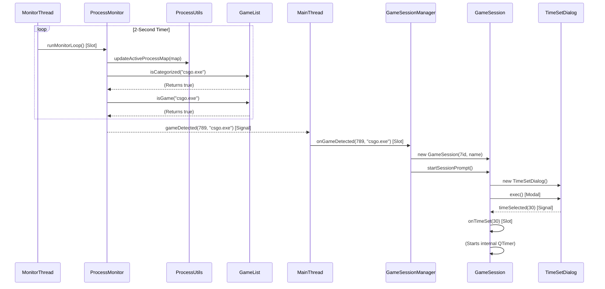
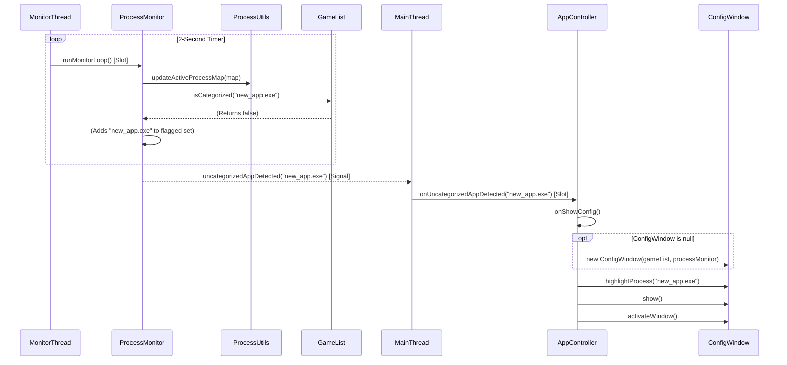

# Sequence Diagrams

This document illustrates key application workflows using sequence diagrams in Mermaid format.

## 1. Application Startup Sequence

This diagram shows the initialization process when the application is first launched. The `AppController` is responsible for creating all core components and starting the background monitoring thread.


```mermaid
sequenceDiagram
    participant User
    participant main()
    participant QApplication
    participant AppController
    participant GameList
    participant ProcessMonitor
    participant QThread
    participant GameSessionManager
    participant QSystemTrayIcon

    User-->main(): Executes Mindfulness.exe
    main()-->QApplication: new QApplication()
    main()-->AppController: new AppController()

    AppController-->GameList: new GameList()
    GameList-->GameList: load()
    GameList-->AppController: (Returns)

    AppController-->GameSessionManager: new GameSessionManager()
    AppController-->ProcessMonitor: new ProcessMonitor(gameList)
    AppController-->QThread: new QThread()
    AppController-->ProcessMonitor: moveToThread(thread)

    AppController-->QSystemTrayIcon: new QSystemTrayIcon()
    AppController-->QSystemTrayIcon: show()

    AppController-->AppController: connectSignals()
    AppController-->QThread: start()
    QThread-->ProcessMonitor: startMonitor() [Slot]

    main()-->QApplication: exec()
```


2. New Game Detection Sequence
This diagram shows the flow when the `ProcessMonitor` (running in its background thread) detects a process that is categorized as a "Game."



3. Uncategorized App Detection Sequence
This diagram shows the flow when the `ProcessMonitor` detects a new process that it does not recognize from the `GameList`.



4. Game Session Lifecycle (Timer and Termination)


5. Early Game termination (User Quits Manually)